  
  
  

## ⭐ Projetos em destaque

> **O sistema que eu mais uso.** Roda todo dia numa rede de postos: às 8h cada gerente recebe no
> WhatsApp a lista do que contar, e o resto do dia ele fica de olho no ERP. É um sistema interno,
> por isso o código é privado.
>
> **Na AWS desde setembro de 2026:** EC2 em São Paulo com Docker Compose (PostgreSQL, sistema e
> WhatsApp em containers), IP fixo, orçamento com alerta e liga/desliga automático por horário
> (EventBridge Scheduler). O deploy é um script: empacota sem segredos, sobe e confere.

 

> **[Ver o código da Lumi](https://github.com/BrunoBergamin/desafio-dio-spring-ai-budgeting)** · sobe com
> `docker compose up` · feita no desafio de Spring AI da DIO com o Itaú. Funciona pelo site e pelo
> WhatsApp, e o modelo não consegue ler os dados de outro usuário (tem teste provando).

 

> **Em ajuste.** Feito para substituir o sistema de uma loja de conveniência. O próximo passo é emitir
> a NFC-e direto na SEFAZ, que é o que falta para ele entrar no caixa. Código privado.

## 🧰 Ferramentas

Programo no **IntelliJ IDEA** e no **VS Code**, com o **Claude Code** como par de programação.

## 📦 Outros projetos

| | Projeto | O que é | Ferramentas |
|:-:|---|---|---|
| 🛍️ | **[FlaBeauty](https://flabeauty.com.br)** · no ar | E-commerce de moda em produção, com pagamento (Pix, cartão e boleto), nota fiscal e frete integrados | Next.js · TypeScript · Supabase |
| ☕ | **[OrderFlow](https://github.com/BrunoBergamin/orderflow)** | Estudo de sistema de pedidos com Kafka: idempotência, Transactional Outbox, DLQ e conciliação em lote | Java 21 · Spring Boot · Kafka · PostgreSQL |
| 🧩 | **[Motor de checkout](https://github.com/BrunoBergamin/lab-padroes-projeto)** | 12 padrões de projeto no mesmo problema, escritos em Java puro e em Spring | Java 21 · Spring Boot |
| 🏪 | **[Conveniência Vendas](https://github.com/BrunoBergamin/conveniencia-vendas)** | Microsserviços com banco por serviço, saga com compensação e Kubernetes | Java 21 · Spring Boot · Quarkus |
| ⛽ | **Gestão fiscal dos postos** 🔒 | Suíte desktop: NF-e, conferência de pagamentos, descontos em PDF e clientes a prazo | Python · PySide6 · SQL |
| 🏛️ | **CâmaraGest** 🔒 | Gestão de gabinete e demandas do cidadão para câmaras municipais | JavaScript · Supabase |
| 🎯 | **[Ponto Cego](https://github.com/BrunoBergamin/ponto-cego)** | Diagnóstico interativo com hero 3D em WebGL | JavaScript · WebGL |
| 🔎 | **Análises digitais** 🔒 | Auditorias de sites e da presença online de empresas | HTML |
| 📚 | **[Estudos](https://github.com/BrunoBergamin/estudos)** | Exercícios e cursos de Java, SQL, Python e Git | Java · SQL · Python |

## 📫 Contato

📍 Boituva, SP · **aberto a vagas de desenvolvedor back-end Java**
